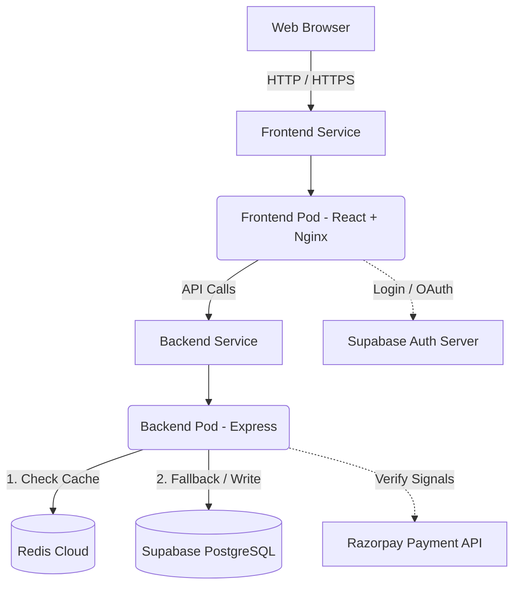

# Project Report: Taskflow 
**A Cloud-Native, Multi-User SaaS Application**

---

## 1. Project Overview & Objectives
Taskflow is a scalable, enterprise-grade task management application built using a microservices architecture. The objective of this project was to transition from a basic monolithic CRUD app to a resilient, cloud-native Software-as-a-Service (SaaS) platform. 

The project strictly follows modern DevOps practices and emphasizes high availability, secure authentication, external payment processing, and containerized deployment.

**Core Objectives Achieved:**
- Multi-tenant architecture supporting individual user workspaces.
- Secure JWT tokenization and OAuth integrations.
- Tiered subscription model (Free vs. Premium) with real-world payment gateway verification.
- High-performance caching layer using an in-memory datastore.
- Containerized frontend and backend deployed as independent microservices using Kubernetes orchestration.

---

## 2. Technology Stack
> [!NOTE]
> The stack was deliberately chosen to reflect modern enterprise paradigms, balancing development speed with production-level scalability.

### **Frontend**
- **React.js & Vite**: Chosen for rapid build times and reactive UI rendering.
- **Vanilla CSS**: Used for complete control over the design system, utilizing CSS Variables for dynamic themes, glassmorphism UI elements, and complex CSS animations.
- **Nginx**: Operates as the static file server inside the Docker container, configured explicitly for Single Page Application (SPA) routing.

### **Backend**
- **Node.js & Express.js**: Lightweight and asynchronous servers ideal for handling API requests and orchestrating microservices.
- **Supabase (PostgreSQL)**: Serves as the primary persistence layer (Database-as-a-Service) and the Identity Provider (IdP) for Auth.
- **Redis (ioredis)**: Serves as an advanced caching layer to intercept database calls and drastically reduce latency.

### **Infrastructure & DevOps**
- **Docker**: Used to containerize local environments, eliminating "it works on my machine" issues.
- **Kubernetes (K8s)**: Orchestrates the Docker containers, manages self-healing, networking, and horizontal scaling.
- **Vercel & Render**: Used to host the live, public-facing instances of the application alongside local K8s testing.

---

## 3. Architecture & Microservices Design

The application is split into highly uncoupled components to ensure that a failure in one system does not bring down the entire application.

### **1. Frontend Microservice**
- **What it is:** A React application bundled into static files.
- **How it works:** It is served by a lightweight Nginx web server inside an Alpine Linux Docker container.
- **Why we did it:** Separating the UI from the backend allows the frontend to be developed, scaled, and deployed completely independently via CDNs (like Vercel). Nginx was specifically configured with a `try_files` directive to route all unknown paths to `index.html`, fixing standard SPA 404 errors.

### **2. Backend Microservice**
- **What it is:** A RESTful API built with Express.js.
- **How it works:** Exposes endpoints attached to `/api/todos`, `/api/auth`, and `/api/payments`. It acts as the "brain," rejecting unauthorized requests and talking directly to the database.
- **Why we did it:** A dedicated backend allows us to securely hide API keys (like the Razorpay Secret) from the client and perform sensitive operations like cryptography.

---

## 4. Key Implementation Details

### **A. Authentication (JWT & OAuth)**
- **What:** Users authenticate to gain access to their personal workspaces.
- **How:** We integrated Supabase Auth. When a user logs in, the Supabase server issues a **JWT (JSON Web Token)**. The frontend attaches this token to the `Authorization` header of every API request. The backend middleware validates the JWT to securely extract the `user_id`. We also implemented an `/oauth/consent` path, allowing the platform to act as an OAuth identity provider for third-party apps requesting scope access.
- **Why:** Stateless JWT authentication ensures our backend doesn't need to maintain session memory, allowing the NodeJS containers to rapidly scale up and down.

### **B. Redis In-Memory Caching**
- **What:** Storing frequently accessed data in RAM rather than on a hard drive.
- **How:** Intercepts GET requests to `/api/todos`. The backend connects to Redis Cloud using `ioredis`. 
  - **Read Flow:** It checks for the key `todos:{user_id}`. If it exists (cache hit), it returns it in ~5ms. If not (cache miss), it queries PostgreSQL, then writes the result to Redis with a 60-second expiration (TTL).
  - **Write Flow:** Any POST, PUT, or DELETE request immediately invalidates (deletes) that user's specific key in Redis, guaranteeing the next request fetches fresh data.
- **Why:** Drastically prevents database bottlenecks. The indexed `user_id` caching strategy prevents cross-contamination of user data while massively reducing Supabase tier read-costs.

### **C. Premium Monetization & Cryptography**
- **What:** A gateway allowing users to upgrade accounts for high-priority task access.
- **How:** We integrated the test Razorpay checkouts. After payment, Razorpay sends a payload to the backend containing a `razorpay_signature`.
- **The Security Challenge:** Anyone could theoretically send a fake "success" payload to the backend to get a free upgrade.
- **The Solution:** The backend uses Node's native `crypto` library to hash the `order_id` and `payment_id` using the private `RAZORPAY_KEY_SECRET` via the HMAC-SHA256 algorithm. If the generated signature perfectly matches the Razorpay signature, the transaction is biologically proven authentic. Only then is the database `role` upgraded to `premium`.

---

## 5. Kubernetes Orchestration & Deployment

> [!IMPORTANT]
> The infrastructure has been formally defined using declarative YAML manifests, embracing the Infrastructure-as-Code (IaC) methodology.

To run the application, we leverage the following Kubernetes primitives:

#### 1. Pods & Deployments (`deployment.yaml`)
We defined two separate Kubernetes deployments: one for the frontend and one for the backend. By defining `replicas: 2`, Kubernetes ensures that at least two exact clones of both the frontend and backend are always running. If a container crashes, Kubernetes physically destroys the dead pod and spins up a new one automatically (Self-Healing).

#### 2. Services & Networking (`service.yaml`)
Because Pod IP addresses change dynamically as they live and die, we use **Services**. The backend is assigned a `ClusterIP`, creating an unbreakable internal routing address. The frontend uses a `LoadBalancer`, physically exposing port 80 to the host network (localhost) so standard web browsers can access the UI.

#### 3. Kubernetes Secrets
Environment variables (`SUPABASE_URL`, `RAZORPAY_SECRET`, etc.) are stripped from the source code. During deployment, a K8s `Secret` object is injected securely into the backend pod runtime, neutralizing the threat of hardcoded credentials.

#### 4. Horizontal Pod Autoscaler (HPA)
The deployment is rigged to auto-scale based on CPU utilization. If the server is overwhelmed by users (e.g., > 50% CPU usage), the HPA automatically provisions up to 10 additional backend pods, shrinking the cluster back down once traffic subsides.

---

## 6. Conclusion
The completed Taskflow application successfully bridges the gap between a standard university web project and a production-tier enterprise platform. By intentionally utilizing Kubernetes microservices, cryptographic verification, rigorous JWT authentication, and high-speed memory caching, the system is demonstrably robust, secure, and elastically scalable.
